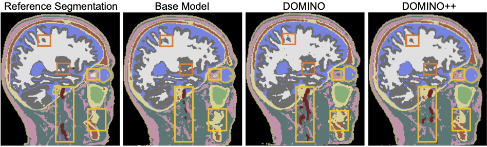

# DOMINO++: Domain-aware Loss Regularization for Deep Learning Generalizability
Out-of-distribution (OOD) generalization poses a serious challenge for modern deep learning (DL). OOD data consists of test data that is significantly different from the model's training data. DL models that perform well on in-domain test data could struggle on OOD data. Overcoming this discrepancy is essential to the reliable deployment of DL. Proper model calibration decreases the number of spurious connections that are made between model features and class outputs. Hence, calibrated DL can improve OOD generalization by only learning features that are truly indicative of the respective classes. Previous work proposed domain-aware model calibration (DOMINO) to improve DL calibration, but it lacks designs for model generalizability to OOD data. In this work, we propose DOMINO++, a dual-guidance and dynamic domain-aware loss regularization focused on OOD generalizability. DOMINO++ integrates expert-guided and data-guided knowledge in its regularization. Unlike DOMINO which imposed a fixed scaling and regularization rate, DOMINO++ designs a dynamic scaling factor and an adaptive regularization rate. Comprehensive evaluations compare DOMINO++ with DOMINO and the baseline model for head tissue segmentation from magnetic resonance images (MRIs) on OOD data. The OOD data consists of synthetic noisy and rotated datasets, as well as real data using a different MRI scanner from a separate site. DOMINO++'s superior performance demonstrates its potential to improve the trustworthy deployment of DL on real clinical data.

## Paper
This repository provides the official implementation of training and evaluation of the model DOMINO++ as described in the following paper:

**DOMINO++: Domain-aware Loss Regularization for Deep Learning Generalizability**

Skylar E. Stolte<sup>1</sup>, Kyle Volle<sup>2</sup>, Aprinda Indahlastari<sup>3,4</sup>, Alejandro Albizu<sup>3,5</sup>, Adam J. Woods<sup>3,4,5</sup>, Kevin Brink<sup>6</sup>, Matthew Hale<sup>7</sup>, and Ruogu Fang<sup>1,3,8*</sup>

<sup>1</sup> J. Crayton Pruitt Family Department of Biomedical Engineering, Herbert Wertheim College of Engineering, University of Florida (UF), USA<br>
<sup>2</sup> Torch Technologies, LLC, Florida, USA<br>
<sup>3</sup> Center for Cognitive Aging and Memory, McKnight Brain Institute, UF, USA<br>
<sup>4</sup> Department of Clinical and Health Psychology, College of Public Health andHealth Professions, UF, USA<br>
<sup>5</sup> Department of Neuroscience, College of Medicine, UF, USA<br>
<sup>6</sup> United States Air Force Research Laboratory, Eglin Air Force Base, Florida, USA<br>
<sup>7</sup> Department of Mechanical and Aerospace Engineering, Herbert Wertheim College of Engineering, UF, USA<br>
<sup>8</sup> Department of Electrical and Computer Engineering, Herbert Wertheim College ofEngineering, UF, USA<br>

International Conference on Medical Image Computing and Computer Assisted Intervention (MICCAI) 2023<br>
[paper](https://arxiv.org/abs/2308.10453) | [code](https://github.com/lab-smile/DOMINOPlusPlus) | [poster](TO BE ADDED)

## Major results from our work

- DOMINO++ improves model performance on head segmentation problems from T1 MRIs
- DOMINO++ particularly improves performance on datasets with rotations, which simulates motion artifacts in MRI
- DOMINO++ also performs better than DOMINO or the baseline model on the standard images, images with Gaussian noise, or different scanner data.

<div align="center">
	
</div>

<div align="center">
  <b>fig. 1:</b> Visual comparison of segmentation performance on a noisy MRI image from Site A. The yellow rectangular regions show areas where DOMINO++ im- proves the segmentation. The orange regions show areas that DOMINO and DOMION++ improve the segmentation over the baseline model.<br>
</div>
<br>

## Usage
You can find there are two MATLAB codes, you can directly change the directory to your own data. You need to select the DOMINO++ working folder and add to path before you running these two MATLAB codes. 

In case of you are using different version of MATLAB, if you are using MATLAB 2020b, you need to change line 56 to :
```
image(index) = tissue_cond_updated.Labels(k)
```
Then you can run the combine_mask.m. The output should be a Data folder with the following structure: 
```
Data ImagesTr sub-TrX_T1.nii sub-TrXX_T1.nii ... 
ImagesTs sub-TsX_T1.nii sub-TsXX_T1.nii ...
LabelsTr sub-TrX_seg.nii sub-TrXX_seg.nii ...
LabelsTs sub-TsX_seg.nii sub-TsX_seg.nii ...
```
Maneuver to the /your_data/Data/. Run make_datalist_json.m

After this code is done, you may exit MATLAB and open the terminal to run the other codes.

### Build container
The DOMINO++ code uses the MONAI, an open-source foundation. We provide a .sh script to help you to build your own container for running your code.

Run the following code in the terminal, you need to change the line after --sandbox to your desired writable directory and change the line after --nv to your own directory.
```
sbatch building_container_v110.sh
```

The output should be a folder named monaicore110 under your desired directory.

### Training
Once the data and the container are ready, you can train the model by using the following command:
```
sbatch train.sh
```
Before you training the model, you need to make sure change the following directory:
- change the first singularity exec -nv to the directory includes monaicore110, for example: /user/DOMINOPlusPlus/monaicore110
- change the line after --bind to the directory includes monaicore110
- change the data_dir to your data directory
- change the model name to your desired model name
You can also specify the max iteration number for training. For the iterations = 100, the training progress might take about one hours, and for the iterations = 25,000, the training progress might take about 24 hours. 

### Testing
The test progress is very similar to the training progress. You need to change all paths and make sure the model_save_name matches your model name in runMONAI.sh. Then running the runMONAI_test.sh with the following command: 
```
sbatch test.sh
```
The outputs for each test subject is saved as a mat file.

### Pre-trained models
You can also use the pre-trained models we provide for testing, please fill out the following request form before accessing the DOMINO++ models.
Download pre-trained models [here](https://forms.gle/3GPnXXvWgaM6RZvr5)


## Acknowledgement

This work was supported by the National Institutes ofHealth/National Institute on Aging (NIA RF1AG071469, NIA R01AG054077),the National Science Foundation (1908299), and the NSF-AFRL INTERN Supplement (2130885). 


We employ UNETR as our base model from:
https://github.com/Project-MONAI/research-contributions/tree/main/UNETR

## Contact
For any discussion, suggestions and questions please contact: [Skylar Stolte](mailto:skylastolte4444@ufl.edu), [Dr. Ruogu Fang](mailto:ruogu.fang@bme.ufl.edu).

*Smart Medical Informatics Learning & Evaluation Laboratory, Dept. of Biomedical Engineering, University of Florida*